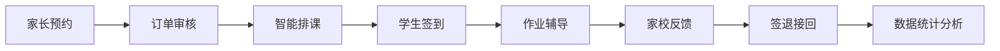
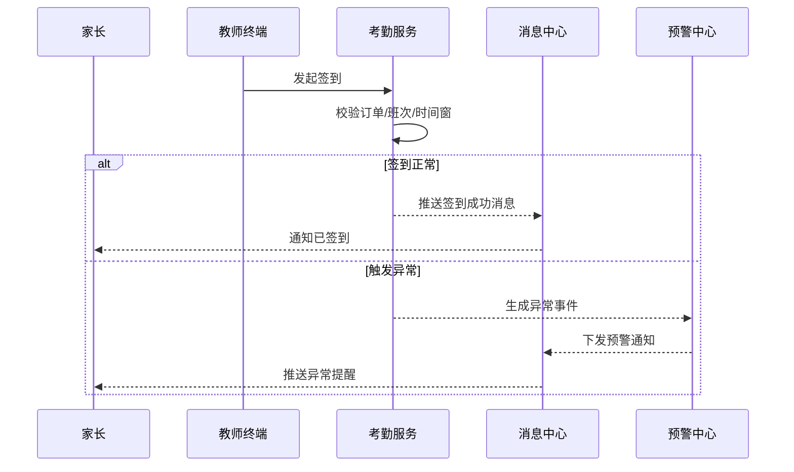
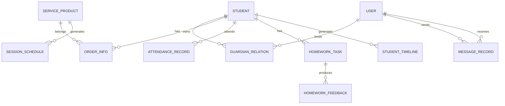
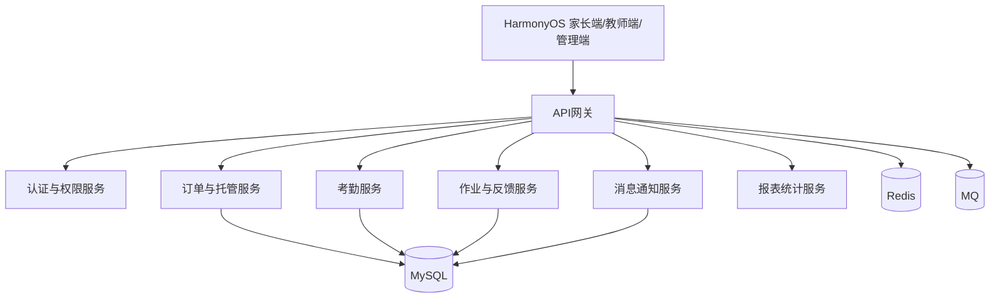

# Mermaid 图册

> 项目名称：基于鸿蒙系统的学生智慧托管系统  
> 文档类型：图册与可视化  
> 版本：V1.2  
> 日期：2026-04-16

---

## 一、业务闭环图

```mermaid
flowchart LR
A[家长预约] --> B[订单审核]
B --> C[智能排课]
C --> D[学生签到]
D --> E[作业辅导]
E --> F[家校反馈]
F --> G[签退接回]
G --> H[数据统计分析]
```

## 二、签到异常预警时序

```mermaid
sequenceDiagram
participant P as 家长
participant T as 教师终端
participant A as 考勤服务
participant M as 消息中心
participant W as 预警中心
T->>A: 发起签到
A->>A: 校验订单/班次/时间窗
alt 签到正常
A-->>M: 推送签到成功消息
M-->>P: 通知已签到
else 触发异常
A-->>W: 生成异常事件
W-->>M: 下发预警通知
M-->>P: 推送异常提醒
end
```

## 三、核心 ER 关系图（文字简化版）

```mermaid
erDiagram
USER ||--o{ GUARDIAN_RELATION : binds
STUDENT ||--o{ GUARDIAN_RELATION : has
STUDENT ||--o{ ORDER_INFO : owns
SERVICE_PRODUCT ||--o{ ORDER_INFO : belongs
SERVICE_PRODUCT ||--o{ SESSION_SCHEDULE : generates
STUDENT ||--o{ ATTENDANCE_RECORD : attends
STUDENT ||--o{ HOMEWORK_TASK : has
HOMEWORK_TASK ||--o{ HOMEWORK_FEEDBACK : produces
USER ||--o{ MESSAGE_RECORD : sends
USER ||--o{ MESSAGE_RECORD : receives
STUDENT ||--o{ STUDENT_TIMELINE : generates
```

## 四、分层架构图

```mermaid
flowchart TB
A[HarmonyOS 家长端/教师端/管理端] --> B[API网关]
B --> C[认证与权限服务]
B --> D[订单与托管服务]
B --> E[考勤服务]
B --> F[作业与反馈服务]
B --> G[消息通知服务]
B --> H[报表统计服务]
D --> I[(MySQL)]
E --> I
F --> I
G --> I
B --> J[(Redis)]
B --> K[(MQ)]
```
