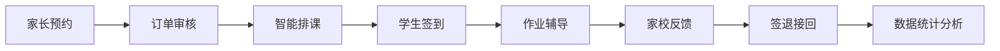
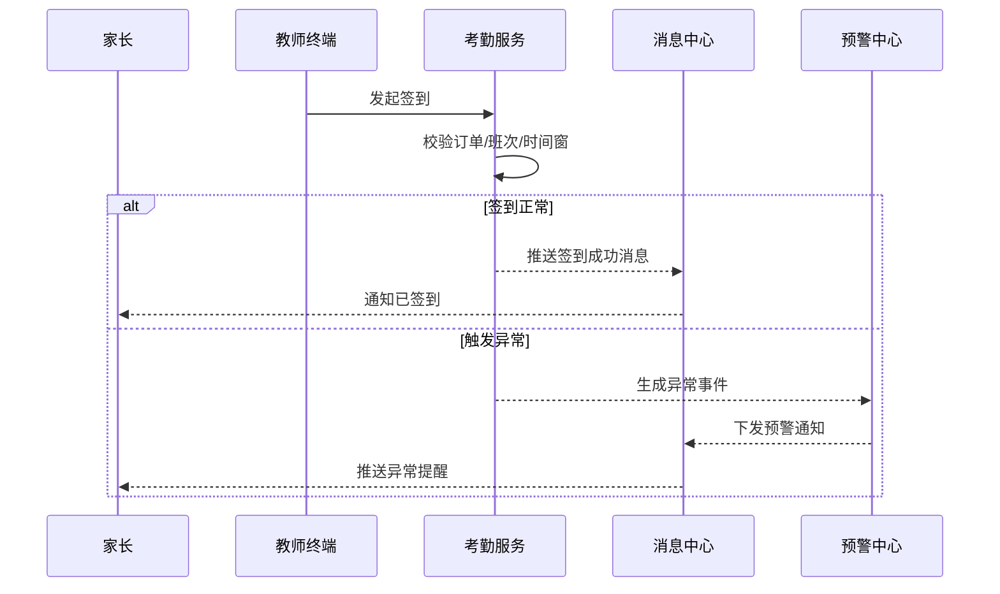
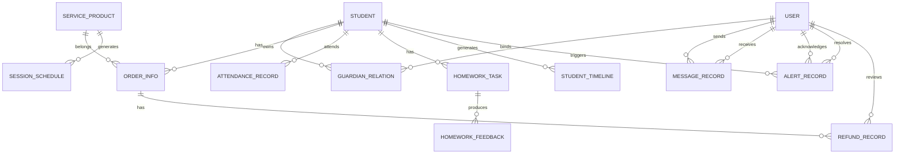
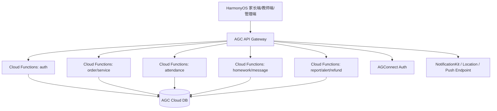
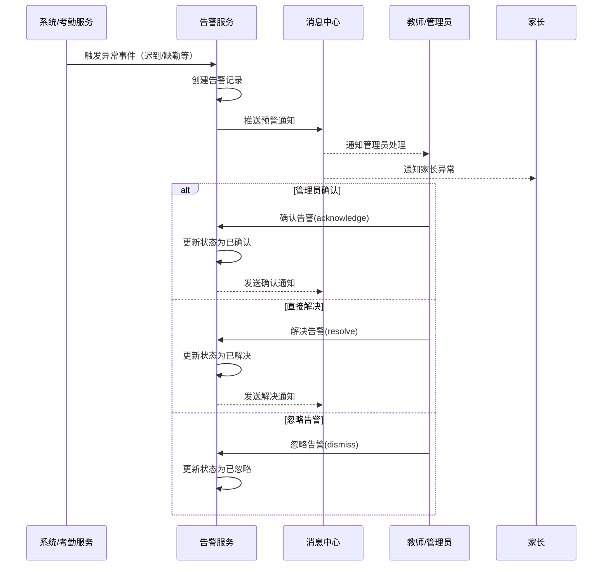
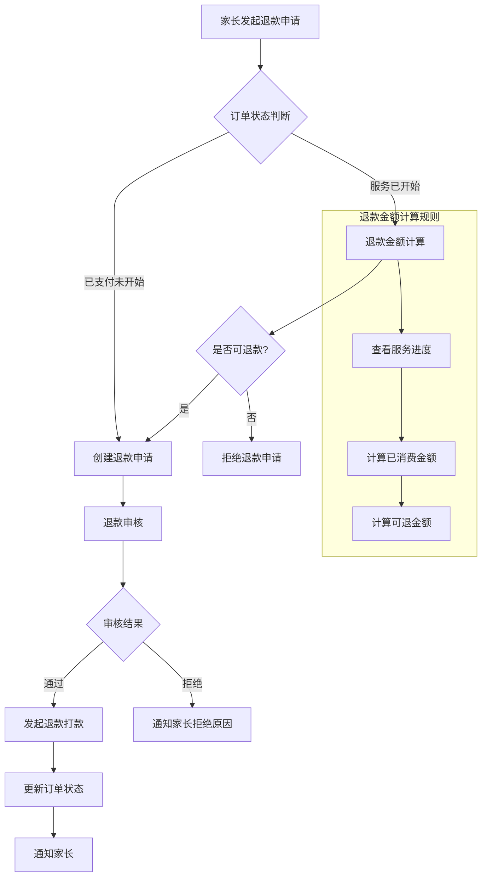

# Mermaid 图册

> 项目名称：基于鸿蒙系统的学生智慧托管系统  
> 文档类型：图册与可视化  
> 版本：V1.4  
> 日期：2026-04-27

---

## 一、业务闭环图

## 二、签到异常预警时序

## 三、核心 ER 关系图（文字简化版）

**新增实体说明：**
- `ALERT_RECORD`：告警记录，关联学生、确认人、解决人
- `REFUND_RECORD`：退款记录，关联订单、审核人

## 四、分层架构图

## 五、告警处理时序图

## 六、退款处理流程图

