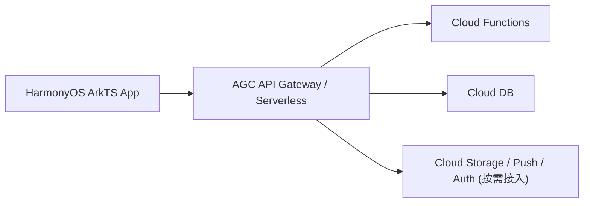

# SmartGuardian AGC Serverless 后端架构迁移方案

> 日期：2026-04-25  
> 目标：把既有 `Spring Boot + MySQL` 主路线切换为 `AGC Serverless + Cloud Functions + Cloud DB`

> 退役状态：截至 2026-04-26，`backend/` 旧 Spring Boot 包已从主线架构移除；本文保留为迁移设计和历史对照，不再表示 Java 后端仍可运行联调。

## 迁移结论

- ✔ 后端主入口不再继续扩展传统自建服务端
- ✔ 业务入口统一切到 AGC API Gateway + Cloud Functions
- ✔ 持久化主数据统一切到 Cloud DB
- ✔ 前端继续保留统一请求层，但请求目标从传统 REST 服务切换到 AGC 调用适配层

## 目标架构

## 分层说明

1. ArkTS 前端
   只保留页面、状态、请求封装和业务服务，不感知具体云函数实现细节
2. AGC 网关层
   统一承接 `/api/v1/*` 外部路由，再按域分发到具体云函数
3. Cloud Functions 业务层
   按 `auth / user / student / service / order / session / attendance / homework / message / report / refund / workbench / alert / timeline / card / payment` 分域
4. Cloud DB 数据层
   承接学生、家长、教师、机构、订单、班次、考勤、作业、消息、报表、退款等核心集合

## P0 要求

1. ✔ 前端请求层切入 AGC 适配器
2. ✔ 云函数分域目录和契约命名统一
3. ✔ OpenAPI 契约重建为 AGC 视角
4. ✔ Cloud DB 模型迁移方案补齐
5. ✔ `cloud-functions/` 实际目录骨架开始落地

## 后续实施

1. P1 先写真实云函数 handler、鉴权和参数校验
2. P1 补齐 Cloud DB 集合、索引、关系和迁移脚本
3. P1 将前端业务服务逐步切到真实云函数返回体
4. P2 再接入 `Account Kit`、`Push Kit`、`Location Kit` 等官方能力

## Cloud DB 环境补充

- `AGC_CLOUD_DB_ZONE` 必须填写 AppGallery Connect 中实际创建的 Cloud DB Zone 名称，不是任意占位值。
- 若当前环境变量为 `clouddbzone1`，只有在控制台里确实创建了名为 `clouddbzone1` 的 Zone 时才有效。
- 服务端导种和 Cloud DB 访问必须使用 `Project settings > Server SDK` 下载的 `agc-apiclient-*.json`。
- `agconnect-services.json` 仅用于客户端 SDK 初始化，不能替代 Server SDK 凭证。

## 官方参考

- [AGC Serverless](https://developer.huawei.com/consumer/cn/agconnect/serverless/)
- [AGC Cloud Functions](https://developer.huawei.com/consumer/cn/agconnect/cloud-function/)
- [AGC Cloud DB](https://developer.huawei.com/consumer/cn/agconnect/cloud-base/)
## 2026-04-26 增量补充

### 会话通知端点注册

- 新增 `POST /api/v1/auth/session-device`，用于把当前登录会话与通知端点元数据绑定。
- 绑定字段落在 `user_sessions`：
  - `deviceId`
  - `notificationToken`
  - `notificationProvider`
  - `authUid`
  - `authPhone`
  - `clientVersion`
  - `clientPlatform`
  - `lastActiveAt`

### 当前状态

- `ClouddbDev` 已手动补齐 `user_sessions` 新字段，且仓库内 [schema.json](/F:/HarmonyOSProjects/SmartGuardian/cloud-functions/cloud-db/schema.json:1) 与生成产物已同步回写后，`POST /api/v1/auth/session-device` 已切回真实持久化。
- 前端登录后注册链无需额外改动，当前会直接更新登录会话上的通知端点元数据。
