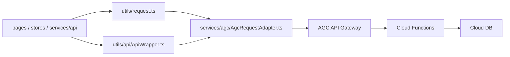

# SmartGuardian 前端请求层 AGC 适配落地说明

> 日期：2026-04-25  
> 目标：让前端请求中台在不大面积改业务服务层的前提下，支持 `AGC API Gateway + Cloud Functions`

## 已落地

✔ `entry/src/main/ets/config/api.config.ts` 已新增 `ApiEnvironment.AGC_SERVERLESS`。  
✔ `entry/src/main/ets/services/agc/AgcRequestAdapter.ts` 已新增 AGC 路由解析与网关请求适配。  
✔ `entry/src/main/ets/utils/request.ts` 已新增 AGC 调用分支。  
✔ `entry/src/main/ets/utils/api/ApiWrapper.ts` 已新增 AGC 调用分支。  
✔ `entry/src/main/ets/config/api.config.example.ts` 已补充 AGC 环境常量。  

## 调用链



## 关键文件

| 文件 | 作用 |
| --- | --- |
| `entry/src/main/ets/config/api.config.ts` | 统一环境与网关地址配置 |
| `entry/src/main/ets/services/agc/AgcRequestAdapter.ts` | 路由前缀 -> 函数域映射、请求头补齐、网关转发 |
| `entry/src/main/ets/utils/request.ts` | 业务服务默认请求入口 |
| `entry/src/main/ets/utils/api/ApiWrapper.ts` | 兼容层请求入口 |

## 配置语义

✔ `StorageKeys.API_ENV` 现在支持 `DEV_MOCK / AGC_SERVERLESS / TEST_REAL`。  
✔ `StorageKeys.API_BASE_URL` 在 `AGC_SERVERLESS` 模式下表示 `API Gateway` 地址。  
✔ `DEV_MOCK` 仍保留，方便演示和无网开发。  
✔ `TEST_REAL` 暂保留为过渡态，避免旧联调链路一次性全部删空。  

## 适配规则

### 1. 路由不改名

✔ 业务服务继续请求 `/api/v1/...`。  
✔ AGC 适配层按路径前缀解析 `domain + functionName`。  

### 2. 统一加头

✔ 已统一追加：

```text
X-SmartGuardian-Request-Mode
X-SmartGuardian-Function-Domain
X-SmartGuardian-Function-Name
X-SmartGuardian-Function-Route
Authorization
```

### 3. 错误处理不分叉

✔ 401/403 仍回到统一登录清理逻辑。  
✔ 业务错误仍走现有 `ApiResponseHelper` 判定，不强迫页面层改写。  

## 当前边界

✔ 这次先完成“请求中台切换能力”，不强行要求所有 `services/api/*` 重命名。  
✔ 登录页环境入口仍是配置驱动，后续可再补一个可视化调试入口。  
✔ `PATCH` 仍未启用，继续保持和现有 `NetworkKit` 能力一致。  

## 官方依据

- [Serverless云开发](https://developer.huawei.com/consumer/cn/agconnect/serverless/)
- [云函数](https://developer.huawei.com/consumer/cn/agconnect/cloud-function/)
- [API网关](https://developer.huawei.com/consumer/cn/agconnect/serverless/use-cases/api-gateway/)
